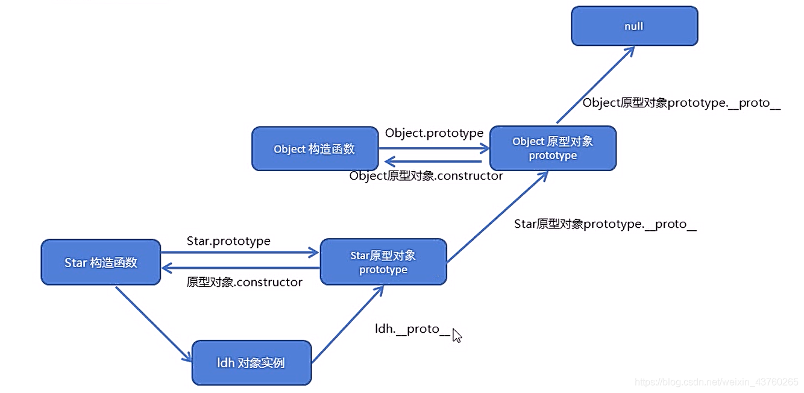

# 前端面试
## Vue部分

### <font color="red">v-if和v-show</font>
__当条件不成立时，v-if不会渲染dom元素，v-show只是操作css样式（display），且换当前dom显示和隐藏__
相同点：都是控制元素的显示和隐藏
不同点：
- v-show：
1.设置css属性中的display为none
2.会编译，只是初始值为false，所以将display设置为none
3.只编译一次，性能好一些
4.适用于频繁切换某节点时，切换性能消耗小，但是初始性能消耗大
- v-if：
1.dom树中添加或删除dom元素
2.如果初始值为false时不会编译
3.不停的创建和销毁，性能差一点
4.初始渲染开销小，但是切换开销大

__性能__
v-show只编译一次，后面其实就是控制css，而v-if不停的销毁和创建，故v-show性能更好一点。

## JS部分
### <font color="red">this的指向</font>
**1.当函数作为构造函数，通过new xxx()调用时，this指向生成的实例**

```javascript
    function Cat(name,color){
        　　　　this.name=name;
        　　　　this.color=color;
        　　}
        let cat1 = new Cat("大毛","橘色");//this指向的cat1
        let cat2 = new Cat("二毛","黑色");//this指向的cat2
        console.log(cat1); 
        console.log(cat2); 
```

**2.当函数直接被调用时（通过 xxx()的方式调用）this指向window对象,严格模式下为undefined**

```javascript
    function Cat(name,color){
        　　　　this.name=name;
        　　　　this.color=color;
        　　}
       Cat("大毛","橘色");
       console.log(window.name)//大毛
       console.log(window.color)//橘色
```

**3.当函数被调用时，它是作为某个对象的方法（前面加了 点'.'）this指向这个对象（点'.'前面的对象）**(谁调用它，它就指向谁)

```javascript
    function setDetails(name,color){
            　　　　this.name=name;
            　　　　this.color=color;
            　　}
    let cat={};
    cat.setDetails=setDetails;
    cat.setDetails('大毛','橘色');
    console.log(cat.name)//大毛
    console.log(cat.color)//橘色
```


### <font color="red">实现call/apply/bind</font>


**1.实现call**
```javascript
let p = {}
function setDetails(name, age) {
    this.name = name
    this.age = age
    return console.log(this)
}
//实现call
Function.prototype.call2 = function (context) {
    let mySymbol = Symbol()
    context[mySymbol] = this
    let args = Array.from(arguments).slice(1)
    let result = context[mySymbol](...args)
    delete context[mySymbol]
    return result
}
// setDetails.call2(p,'lsy', 18)
//实现apply
Function.prototype.apply2 = function (context) {
    let mySymbol = Symbol()
    context[mySymbol] = this
    let argsArr = Array.from(arguments)[1] || []
    let result = context[mySymbol](...argsArr)
    delete context[mySymbol]
    return result
}
// setDetails.apply2(p,['lsy',18])
//实现bind
Function.prototype.bind2 = function (context) {
    let mySymbol = Symbol()
    context[mySymbol] = this
    let args = Array.from(arguments).slice(1);
    function fn() {
        let bindArgs = Array.from(arguments)
        return context[mySymbol].apply(this instanceof fn ? this /*作为构造函数调用*/ : context, args.concat(bindArgs))
    }
    fn.prototype = Object.create(this.prototype) //继承
    return fn
}
```

### <font color="red">原型链的理解</font>

两者的constructor即为构造函数

- 首先说好了的每一个实例都有__proto__，而这个就指向的是构造函数的对象原型，所以ldh.__proto__和Star.prototype是等价的，即ldh.proto`能够只会Star这个构造函数呢，本质上就是通过Star.prototype指回去的。
- 那么我们就会想到Star.prototype的__proto__指向的会是谁呢，一打印就能看的出指向的是Object.prototype，所以不用想也知道他的构造函数肯定是Object了
- 那Object.prototype还有没有__proto__，打印一看就知道是为null，所以我们知道原型的终点就是null

#### js的成员查找机制
- 当访问一个对象的属性或者方法的时候，首先查找这个对象自身有没有这个属性
- 如果没有就去找他的原型，也就是__proto__指向的prototype原型对象
- 如果还没有就去查找原型对象的原型，即Object的原型对象
- 以此类推一直找到null为止

### <font color="red">事件冒泡，事件捕获，事件委托</font>
#### 1.事件冒泡(event bubbling)

微软提出了名为事件冒泡的事件流。事件按照从最特定的事件目标到最不特定的事件目标(document对象)的顺序触发。可以想象把一颗石头投入水中，泡泡会一直从水底冒出水面。也就是说，事件会从最内层的元素开始发生，一直向上传播，直到document对象。
#### 2.事件捕获(event capturing)

网景提出另一种事件流名为事件捕获。事件从最不精确的对象(document 对象)开始触发，然后到最精确(也可以在窗口级别捕获事件，不过必须由开发人员特别指定)，与事件冒泡相反，事件会从最外层开始发生，直到最具体的元素。同样形象的比喻一下可以想象成警察逮捕屋子内的小偷，就要从外面一层层的进入到房子内
#### 3.阻止事件冒泡

①e.stopPropagation()
#### 4.事件委托
事件冒泡机制
- 大量减少内存占用，减少事件注册。（原本需要对每个.li注册，现在只对上级元素注册）
- 新增元素实现动态绑定事件。 

**实现方式：**
**1.原生JS**
```javascript
// 给ul添加监听器
document.getElementById("ul").addEventListener("click",function(e) {
// e.target是被点击的元素!
// 筛选触发事件的子元素如果是li执行的事件
if(e.target && e.target.nodeName.toLowerCase() == "li") {
// 获取到具体事件触发的li，输出其id
console.log("List item ",e.target.id.replace("post-")," was clicked!");
}
});
```
**2.Jquery**
```javascript
$("#ul").on("click","li",function(){});
```


